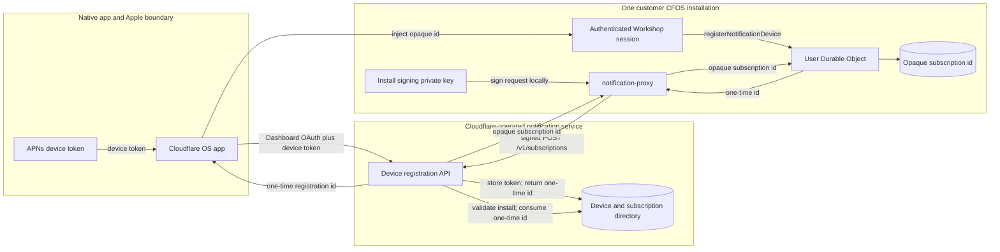
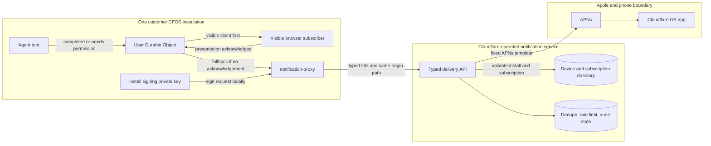

# Notifications architecture

Notifications are a platform feature, not a gatekeeper. The Workshop backend can call the
install-local `notification-proxy` through the explicit `NOTIFICATION_DELIVERY` service binding,
but the proxy has no public route and is never included in `GATEKEEPER_*` discovery, connector UI,
or agent bindings.

The proxy is stateless: it holds the installation signing key, so Workshop core never sees it, and
signs each request to the Cloudflare-operated notification service. Each User Durable Object
stores the opaque subscription id of the device it most recently registered; registering another
device replaces it, so push reaches one device per user. The central service owns APNs delivery
and the device/subscription directory, and accepts only fixed, typed notification templates. It
does not accept arbitrary notification text or any provider OAuth credential.

## Registration

Data boundaries:

- The APNs device token and Dashboard OAuth bearer never enter the customer installation.
- The install signing private key never leaves `notification-proxy`.
- Workshop core stores only the opaque central subscription id, which is bound to the installation
  and useless without the install signing key.
- A one-time device registration id is short-lived and cannot send a notification.

The native app hands the SPA a one-time registration id by setting
`window.__CLOUDFLARE_OS_NOTIFICATION_DEVICE_REGISTRATION__` before load or dispatching a
`cloudflare-os:notification-device-registration` `CustomEvent` with
`detail.deviceRegistrationId`. If none was injected, the SPA calls
`window.__CLOUDFLARE_OS_REQUEST_NOTIFICATION_DEVICE_REGISTRATION__()`, when present, once each
time the signed-in app mounts (a WebSocket reconnect does not remount it) to request one.
The SPA reports the outcome to `webkit.messageHandlers.cloudflareOSNotificationReady` as
`{type: "ready"}` or `{type: "failed"}`.

## Delivery

Only the event id, event type, task id (`<workspaceId>:<chatId>`), bounded chat title, opaque
subscription id, and same-origin deep-link path cross the central boundary during a send.
Permission details, chat content, gatekeeper grants, and provider credentials do not. A visible
browser tab is offered the notification first, and push is sent only if no tab acknowledges it
within three seconds. Turns started by a gadget callback, such as a schedule, notify only when
they need the user's permission.

## Deployment contract

The release manifest classifies `notification-proxy` as a non-installable, preinstalled `system`
worker. The trusted deploy service must inject these values only into that worker:

- `NOTIFICATION_SERVICE_URL`
- `CFOS_INSTALL_ID`
- `CFOS_INSTALL_KEY_ID`
- `CFOS_INSTALL_PRIVATE_KEY`

Self-hosted deployments may omit them. Browser notifications continue to work; native device
registration fails and the SPA reports `{type: "failed"}` to the app.
