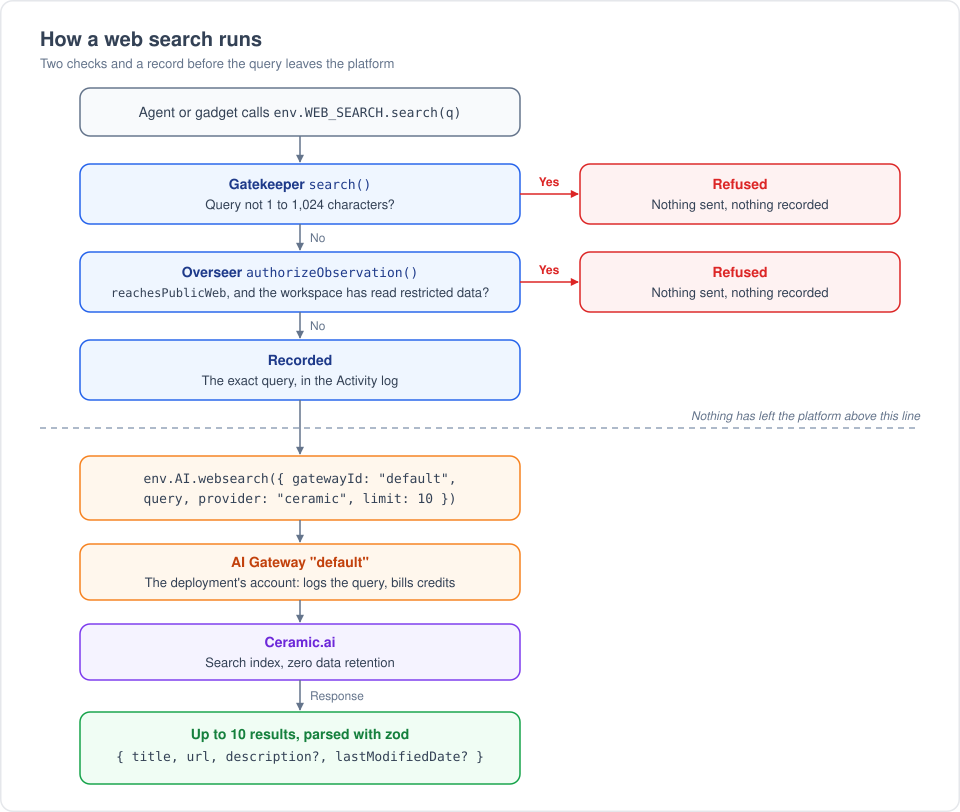

# Web Search

Web Search is an ambient gatekeeper that lets the agent and gadgets search the public web through
Cloudflare's [Web Search API](https://developers.cloudflare.com/web-search/). It has no connect
flow, no settings and no management UI.

## Who gets it

The admin Gatekeepers panel sets the mode (`provisioning-policy.ts` in workshop-backend):

- **Enabled** (the default): every user gets it, and can't turn it off.
- **Optional**: each user turns it on once, on the Connectors page. A user who got it under
  Enabled keeps it, and can now remove it.
- **Disabled**: no one gets it, and existing accounts go dormant.

The other auto-provisioned gatekeepers default to Optional. Web Search defaults to Enabled because a
search follows the same restricted-data rule as the agent's `webFetch` tool, which every agent has.

A user who has it gets a `WEB_SEARCH` binding in the agent's `executeCode`, in every workspace. The
agent can bind it into a gadget with `setGadgetBinding`. The binding appears in chats that start
after the workspace next opens, because a chat's bindings are fixed when it starts.

A change of mode, or a user turning it off, also takes effect when each workspace next opens. Until
then, its open chats and scheduled gadgets can still search. Uninstalling the Worker stops every
search at once.

## Agent API

The binding exposes `WebSearchSession`. The contract lives in [`src/types.d.ts`](src/types.d.ts).

```js
export default async function(self, env) {
  const results = await env.WEB_SEARCH.search("durable objects alarms");
  // [{ title, url, description?, lastModifiedDate? }, ...]
}
```

`query` is 1 to 1,024 characters, the API's limits. The caller picks no provider and no result
count, and gets up to 10 results.

## How a search runs

<p align="center"></p>

`src/search.ts` does the work:

1. It refuses a query outside 1 to 1,024 characters. Nothing is sent or recorded.
2. It records the query through the session's `ApprovalQueue`, marked `reachesPublicWeb`. The query
   goes in a literal field, built with gatekeeper-kit's `buildDescription`, so the record shows
   exactly what was sent. If the record is refused or fails, nothing is sent.
3. It calls `env.AI.websearch({ gatewayId: "default", query, provider: "ceramic", limit: 10 })`.
4. It parses the response with zod, which drops the image and favicon fields. A failed search
   throws `Web search failed with HTTP <status>.` without the provider's body, which can quote the
   query back. The record stays.

## Security

A query is text the caller chose, sent to a third party: the same leak as a `webFetch` URL. So a
search follows `webFetch`'s rule.

- **Restricted workspaces.** Once a workspace has observed restricted data, the Overseer refuses
  every observation marked `reachesPublicWeb`, with the error that refuses the agent's web fetches.
  The check runs in `authorizeObservation` before anything is recorded, so a refused search leaves
  no record and sends nothing. Each search is its own observation, so a session opened before the
  workspace became restricted is refused too.
- **Observers.** `addObserver` admits every collaborator, because search results are public. A
  query can still carry workspace text. The restricted-data check covers data that a gatekeeper
  marked restricted, and nothing else.
- **Ambience.** The gatekeeper declares only that it can mint an account and that the account has
  a singleton. The Workshop's provisioning policy makes it Enabled by default, and the admin's mode
  overrides that.

## Why Cloudflare's Web Search API

- It runs on a Workers AI binding and an AI Gateway. Every account has a gateway named `default`,
  so the gatekeeper needs no secrets, inputs or deploy-service configuration.
- Logs, billing and provider keys stay in AI Gateway.
- The standalone `web_search` Worker binding (`env.WEBSEARCH.search`) is not an option. Cloudflare
  removed it before launch ([workers-sdk#15453](https://github.com/cloudflare/workers-sdk/pull/15453)).
  Its types are still in the generated `worker-configuration.d.ts` files.

## Why Ceramic

<p align="center"></p>

- **Zero data retention.** A query can carry workspace text, so the provider must not keep it.
  Exa offers no zero data retention, so we exclude it.
- **Cost.** $0.25 per 1,000 searches: a twentieth of Linkup and a twenty-eighth of Exa.
- **Content.** Ceramic runs its own index of 40B+ pages and returns descriptions of up to 8,000
  characters, so a result often answers the question without a fetch.
- **Pinned in code.** `search.ts` sets `provider: "ceramic"` instead of trusting the API's default,
  which Cloudflare could change to a provider that keeps data. There is no fallback chain: each
  fallback would be one more way out of the platform.
- **Linkup** is the other provider with zero data retention. Switching to it changes one constant.

We rejected model-native search (Anthropic, OpenAI, Gemini). It runs at the model provider, so it
skips the restricted-data check and the audit. It also costs $10 to $35 per 1,000. We rejected direct
vendor APIs (Brave, Tavily, Parallel and others) because each needs a new secret and sends traffic
outside AI Gateway.

## Deployment

- The release manifest gives the Worker an `AI` binding and asks for no inputs. The deploy service
  installs it on every new deploy, like Scheduled Tasks and the Context Library.
- **Billing.** Each search spends the deployment account's AI Gateway credits. The free daily
  allowance and Cloudflare-credits top-up for models do not cover searches, and there is no
  per-user limit. On a public server, set the mode to Disabled unless you accept that: by default,
  every user has it.
- **Local dev.** Start with `pnpm dev-server -- --use-workers-ai-binding`, which needs a Cloudflare
  login. Without the flag the Worker has no `AI` binding and every search fails.

## Known limits

- **No approval.** A search is a read: recorded, not queued. Code that runs on a schedule can send
  workspace data in a query with no one present.
- **Untrusted results.** Results are page text. An agent that reads them can meet a prompt
  injection, as with `webFetch`.
- **Gateway logs.** The `default` gateway logs each query (log collection is on by default), apart
  from the deployment's model gateway when that has another name. Ceramic's zero data retention
  covers Ceramic, not those logs. The `default` gateway's own settings, such as rate limits, apply.
- **Your own Ceramic key.** If an operator stores a Ceramic key on the `default` gateway, their own
  agreement with Ceramic applies instead of AI Gateway billing.
- **A later restricted read.** The check covers searches made after the workspace became
  restricted. A query sent earlier is already gone.
- **An older Workshop.** A Workshop backend that predates `reachesPublicWeb` ignores the flag and
  lets searches through in restricted workspaces. Deploy the backend with this gatekeeper.
- **Blueprints.** A blueprint export drops ambient bindings, so a gadget installed from a blueprint
  loses `WEB_SEARCH` until the agent binds it again with `setGadgetBinding`.
